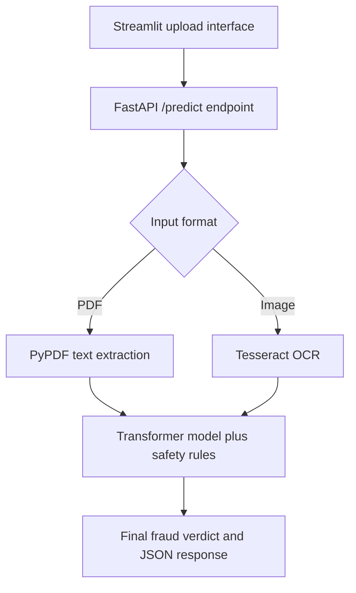

# Fraud Job Posting Analyzer

An AI-powered job-posting fraud analyzer that accepts PDF documents and image screenshots, extracts their text, and classifies the posting as real or potentially fraudulent. The application combines a locally stored Transformer classifier with rule-based safety checks to provide a more cautious final verdict.

## Features

- Upload job postings as PDF, PNG, JPG, or JPEG files.
- Extract text from text-based PDFs with `pypdf`.
- Extract text from image screenshots with Tesseract OCR.
- Classify postings with a local Hugging Face sequence-classification model.
- Display real and fraudulent confidence scores.
- Apply a safety override when high-risk patterns are detected.
- Show the raw model prediction and an extracted-text preview.
- Expose a FastAPI endpoint for programmatic use.
- Provide a Streamlit interface for non-technical users.
- Select CUDA automatically when available and fall back to CPU.

## How It Works



### Analysis pipeline

1. The user uploads a job-posting PDF or image through Streamlit.
2. FastAPI routes the file to the appropriate extraction method.
3. Extracted text is passed to the local Transformer classifier.
4. The model returns a raw real/fraud prediction and softmax scores.
5. Regex-based safety rules scan for suspicious phrases.
6. If a risk pattern is found while the model predicts “real,” the safety override changes the final verdict to fraudulent.
7. The frontend displays the verdict, confidence scores, warning status, and text preview.

## Project Structure

```text
.
├── app_v2.py                    # FastAPI backend and inference pipeline
├── frontend_streamlit.py        # Streamlit user interface
├── requirements.txt             # Python dependencies
└── prod_job_classifier/         # Local fine-tuned Transformer model
    ├── config.json
    ├── model.safetensors        # or pytorch_model.bin
    ├── tokenizer_config.json
    ├── tokenizer.json / vocab files
    └── special_tokens_map.json  # if required by the tokenizer
```

The trained model directory is required at `./prod_job_classifier` and is not included in this source package. Do not commit large model artifacts unless your repository and Git LFS configuration support them.

## Technology Stack

- **Frontend:** Streamlit
- **Backend:** FastAPI and Uvicorn
- **Language:** Python
- **NLP model:** Hugging Face Transformers
- **PDF extraction:** PyPDF
- **Image OCR:** Tesseract OCR through `pytesseract`
- **Image handling:** Pillow
- **Inference:** PyTorch
- **Validation/data utilities:** Pydantic, scikit-learn, Joblib

## Requirements

The supplied dependency file is named `requirements(1).txt`. Rename it to `requirements.txt` when uploading it to GitHub, or install it using its current name.

The supplied file contains the base API and utility dependencies. The application also imports the following runtime packages:

```text
fastapi
uvicorn
pydantic
torch
transformers
Pillow
pypdf
pytesseract
requests
streamlit
scikit-learn
joblib
```

Install the dependencies with:

```bash
python -m pip install --upgrade pip
pip install -r requirements.txt
pip install torch transformers Pillow pypdf pytesseract requests streamlit
```

For GPU support, install the PyTorch build that matches your CUDA version from the [official PyTorch installation guide](https://pytorch.org/get-started/locally/).

## Tesseract OCR Setup

Image analysis requires the Tesseract OCR executable in addition to the Python `pytesseract` package.

Verify that Tesseract is available:

```bash
tesseract --version
```

If Tesseract is installed but is not on your system `PATH`, configure its executable path near the imports in `app_v2.py`:

```python
import pytesseract

pytesseract.pytesseract.tesseract_cmd = r"C:\Program Files\Tesseract-OCR\tesseract.exe"
```

On Linux, install the system package with your distribution's package manager, for example:

```bash
sudo apt-get update
sudo apt-get install -y tesseract-ocr
```

## Model Setup

Place the fine-tuned sequence-classification model in the project root:

```text
prod_job_classifier/
```

The directory should be loadable by both:

```python
AutoTokenizer.from_pretrained("./prod_job_classifier")
AutoModelForSequenceClassification.from_pretrained("./prod_job_classifier")
```

The active label mapping in `app_v2.py` is:

| Model label | Meaning |
|---:|---|
| `0` | Real Job Posting |
| `1` | FRAUDULENT/FAKE Job Posting |

The model's training label order must match this mapping. The model receives a maximum of 512 tokens; longer postings are truncated during inference.

## Run the Application

### 1. Start the FastAPI backend

From the project directory, run:

```bash
uvicorn app_v2:app --host 0.0.0.0 --port 8000
```

Alternatively:

```bash
python app_v2.py
```

The API will be available at:

- API endpoint: `http://127.0.0.1:8000/predict`
- Interactive documentation: `http://127.0.0.1:8000/docs`

### 2. Start the Streamlit frontend

Open a second terminal and run:

```bash
streamlit run frontend_streamlit.py
```

Open the local Streamlit URL shown in the terminal, usually:

```text
http://localhost:8501
```

The frontend expects the backend to be running at `http://127.0.0.1:8000`. If you deploy the API elsewhere, update `API_URL` in `frontend_streamlit.py`.

## API Usage

Send a PDF or image to the prediction endpoint with `curl`:

```bash
curl -X POST \
  -F "file=@sample_job_posting.pdf" \
  http://127.0.0.1:8000/predict
```

Example response:

```json
{
  "final_prediction": "FRAUDULENT/FAKE Job Posting",
  "confidence_real": 12.45,
  "confidence_fake": 87.55,
  "safety_override_triggered": true,
  "model_raw_prediction": "Real Job Posting",
  "extracted_text_snippet": "We are hiring..."
}
```

### Response fields

| Field | Description |
|---|---|
| `final_prediction` | Final verdict after model inference and safety rules. |
| `confidence_real` | Model softmax score for the real-posting class, expressed as a percentage. |
| `confidence_fake` | Model softmax score for the fraudulent-posting class, expressed as a percentage. |
| `safety_override_triggered` | Indicates that a rule-based warning changed a real model prediction to fraudulent. |
| `model_raw_prediction` | Prediction returned by the Transformer before the safety override. |
| `extracted_text_snippet` | First 300 characters of extracted PDF/OCR text. |

## Safety Rules

The current rule-based filter looks for patterns such as:

- Unusually high earnings claims, such as “earn $...” or “$... a week.”
- Daily-payment claims.
- “Wire app” references.
- Telegram chat instructions.
- “No experience required” wording.

These rules are intentionally simple and should be expanded and tested against a representative collection of legitimate and fraudulent job postings before production deployment.

## Supported File Types

| File type | Extraction method |
|---|---|
| PDF | `pypdf` text extraction |
| PNG | Tesseract OCR |
| JPG/JPEG/JPE | Tesseract OCR |

Scanned or image-only PDFs may not produce usable text because the current PDF path uses `pypdf` and does not automatically run OCR on PDF pages. Add a PDF-to-image OCR fallback if scanned PDFs are required.

## Security and Responsible Use

- This tool is a screening aid, not a definitive fraud determination.
- Verify employers, domains, contact details, and payment requests independently.
- Do not upload private identity documents or sensitive personal information to an untrusted deployment.
- The default API binds to `0.0.0.0`; add authentication, HTTPS, request-size limits, file-content validation, logging controls, and rate limiting before exposing it publicly.
- Softmax scores should be treated as model confidence indicators, not calibrated probabilities of fraud.

## Troubleshooting

### Model loading fails

Confirm that `prod_job_classifier` exists in the project root and contains the required model and tokenizer files. Also verify that the model was trained with two output labels in the order documented above.

### Streamlit cannot connect to the backend

Start FastAPI first and confirm that `http://127.0.0.1:8000/docs` opens in a browser. Check that the frontend `API_URL` matches the backend address.

### Image OCR fails

Install the Tesseract system executable, confirm `tesseract --version` works, and configure `pytesseract.pytesseract.tesseract_cmd` when Tesseract is not on `PATH`.

### PDF text is empty

The PDF may be scanned or image-only. Use a text-based PDF or implement a PDF-page OCR fallback.

## Future Improvements

- Add OCR fallback for scanned PDFs.
- Add DOCX and plain-text support.
- Expand and version the fraud-pattern rule set.
- Add calibrated thresholds and explainable evidence highlights.
- Add automated tests for extraction, API validation, and override logic.
- Add authentication and deployment configuration for secure hosting.
- Evaluate on a held-out, independently labeled dataset.

## License

No license has been specified yet. Add a license file before allowing others to reuse, modify, or distribute this project.
